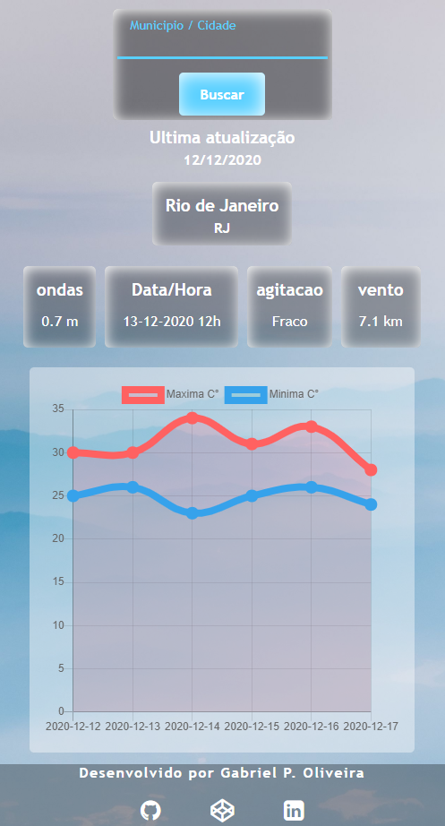

 Para dar uma olhada na aplicação, click <a href="#" target="_blank">aqui.</a>

<h2>Sobre</h2> 

<i>"Usar meu conhecimento para melhorar e testar minhas habilidades como programador".:rocket:</i>

Esse projeto faz parte do meu portfolio, então, fique à vontade para entrar em contato para críticas ou feedback sobre o código, estrutura ou outro motivo que me ajude a me tornar um melhor programador!

E-mail: <a>gabriel.pso100@gmail.com</a > 
<a target="_blank" href="https://www.linkedin.com/in/gabriel-97-oliveira">linkedin</a> 
<h2>Observações</h2>

Foi utilizada a API disponibilizada pela cptec (Centro de Previsão de Tempo e Estudos Climáticos), você pode a conferir clicando <a target="_blank" href="http://servicos.cptec.inpe.br/XML/">aqui</a>

    

<h2>Funcionalidades</h2>

•:partly_sunny: Retorna as informações climáticas de qualquer município do território brasileiro dos próximos 6 dias em formato de gráfico.   
•:ocean: Caso o município pesquisado seja litorâneo, retorna as condições do mar, como tamanho das ondas, agitação e vento.  

<h3>Pré-Requisitos</h3>

Para iniciar esta aplicação, é necessário ter o NODEJS 8+ instalado.

<h3>Instalando</h3>
<h4>Clonando o repositório</h4> 
$ git clone https://github.com/Biel-97/clima_tempo_mar 
$ cd clima_tempo_mar 

<h3>Instalando dependências</h3> 
$ yarn 
<i>OU</i> 
$ npm install 

<h2>Conectando na aplicação</h2> 

Por padrão, a aplicação irá rodar na porta 3000, a URL de acesso então será:

App_URL:  http://localhost:3000/ 
<i>OU</i> 
App_URL=http://SEU_IP_LOCAL:3000/ 

<h2>Iniciando</h2>

Com todas as dependências instaladas, você já pode iniciar a aplicação:

<h3>Dentro da pasta: </h3>
$ npm start

<h2>Criado com</h2>
• React JS  
• Fontawesome 
• axios 
• chart.js  

<h2>Obrigado!</h2>

Duvidas ou sugestões fique à vontade para entrar em contato:

E-mail: <a>gabriel.pso100@gmail.com</a > 

<a href ="http://www.linkedin.com/in/gabriel-97-oliveira" target="_blank">LinkedIn</a>  

:thumbsup:

